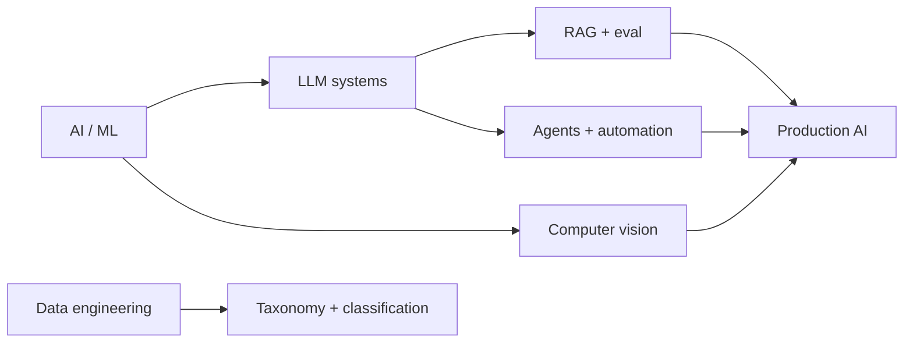

<div align="center">

# `sriharsha_vadavalli`_

### `AI / ML engineer · builder`

`$ whoami` &nbsp; **Sriharsha Vadavalli**  
`$ base` &nbsp; **Hyderabad, India**

[](https://sriharsha-vadavalli.vercel.app/)
[](https://linkedin.com/in/sriharsha-vadavalli)
[](mailto:sriharshavadavalli@gmail.com)
[](https://sriharsha-vadavalli.vercel.app/sriharsha_vadavalli_cv.pdf)

</div>

```text
┌──────────────────────────────────────────────────────────────────────────┐
│  sriharsha@vit:~$ cat profile.txt                                        │
│                                                                          │
│  B.Tech CSE @ VIT Vellore · 9.15 CGPA                                    │
│  Analyst Intern @ Bain & Company                                         │
│  Practical AI systems and data products                                 │
└──────────────────────────────────────────────────────────────────────────┘
```

## `./signal`

```text
80K+ data items   ·   500+ taxonomies   ·   5 merchants
~50% latency reduction in Bain categorization workflows
```

## `./work-map`



## `./projects`

| project | signal |
| --- | --- |
| [RetailRecon](https://github.com/HarVad-1/RetailRecon) | Multi-agent deal hunting with RAG and alerts |
| [Hide & Speak](https://github.com/HarVad-1/hide-and-speak) | Steganography API for text, BMP, and WAV |
| [A3C](https://github.com/HarVad-1/a3c) | RL agent on KungFuMaster Atari |

```text
┌─[ contact ]──────────────────────────────────────────────────────────────┐
│ sriharshavadavalli@gmail.com  ·  linkedin.com/in/sriharsha-vadavalli     │
└──────────────────────────────────────────────────────────────────────────┘
```

<div align="center">

`built with intent` · [harsha.sh](https://sriharsha-vadavalli.vercel.app/)

</div>
