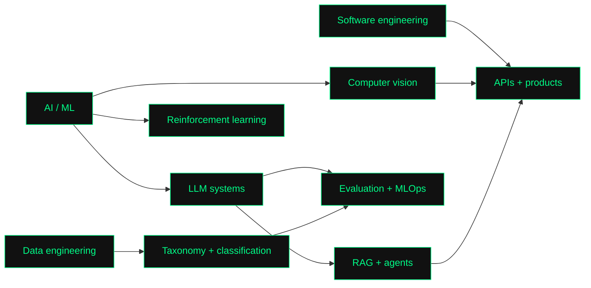

<div align="center">

# `sriharsha_vadavalli`_

### `AI / ML engineer · data scientist · builder`

`$ whoami` &nbsp; **Sriharsha Vadavalli**  
`$ status` &nbsp; **open to work** · Hyderabad, India

[](https://sriharsha-vadavalli.vercel.app/)
[](https://linkedin.com/in/sriharsha-vadavalli)
[](mailto:sriharshavadavalli@gmail.com)
[](https://sriharsha-vadavalli.vercel.app/sriharsha_vadavalli_cv.pdf)

</div>

```text
┌──────────────────────────────────────────────────────────────────────────┐
│  sriharsha@vit:~$ cat about.txt                                          │
│                                                                          │
│  B.Tech Computer Science @ VIT Vellore · 9.15 CGPA                       │
│  Analyst Intern @ Bain & Company                                         │
│  I build practical AI systems, data products, and software people can   │
│  actually use.                                                           │
│                                                                          │
│  Current focus: LLM systems · RAG · evaluation · MLOps · data platforms  │
└──────────────────────────────────────────────────────────────────────────┘
```

## `./impact`

```text
80K+  data items       500+  taxonomies       5  merchants
~50%  inference latency reduction at Bain & Company
  2   AI/ML internships · 6 certifications · 20 project repositories
```

## `./work-map`



## `./experience`

| role | where | signal |
| --- | --- | --- |
| Analyst Intern | Bain & Company · Jan 2026 - present | Categorization pipelines, taxonomy optimization, LLM-assisted validation |
| Artificial Intelligence Intern | Bharat Electronics Limited · May - Jun 2025 | 3D reconstruction, computer vision, representation learning |
| Senior Core → Executive Member | Juvenile Care, VIT | Community leadership and student initiatives |

## `./featured-projects`

| project | what it does | stack |
| --- | --- | --- |
| [RetailRecon](https://github.com/HarVad-1/RetailRecon) | Autonomous multi-agent deal hunting with RAG, price prediction, and SMS alerts | `Python` `RAG` `LLaMA` `Twilio` |
| [A3C](https://github.com/HarVad-1/a3c) | Reinforcement-learning agent trained on KungFuMaster Atari | `PyTorch` `A3C` `Gymnasium` |
| [Hide & Speak](https://github.com/HarVad-1/hide-and-speak) | Steganography API for text, BMP images, and WAV audio | `FastAPI` `LSB` `Python` |
| [Malicious Traffic Detection](https://github.com/HarVad-1/Malicious-Traffic-and-Anomaly-Detection) | ML-assisted IDS with rule generation and false-positive reduction | `Flask` `NLP` `Scikit-Learn` |
| [SignSentry](https://github.com/HarVad-1/SignSentry) | Dashcam object detection with driver safety feedback | `YOLO` `OpenCV` `TTS` |
| [Natours API](https://github.com/HarVad-1/natoursapi) | Tour-booking backend with auth, payments, reviews, and admin tools | `Node.js` `MongoDB` `Stripe` |

## `./toolbox`

```json
{
  "languages": ["Python", "SQL", "C++", "JavaScript"],
  "ai": ["LLM systems", "RAG", "agents", "model evaluation", "PyTorch"],
  "data": ["Snowflake", "PySpark", "AWS", "GCP", "ChromaDB", "MLOps"],
  "backend": ["FastAPI", "Flask", "Node.js", "REST APIs", "microservices"]
}
```

## `./activity`

<div align="center">


</div>

```text
┌─[ contact ]──────────────────────────────────────────────────────────────┐
│ sriharshavadavalli@gmail.com  ·  linkedin.com/in/sriharsha-vadavalli     │
│ Hyderabad, India              ·  open_to_work=true                      │
└──────────────────────────────────────────────────────────────────────────┘
```

<div align="center">

`built with curiosity, shipped with intent` · [harsha.sh](https://sriharsha-vadavalli.vercel.app/)

</div>
